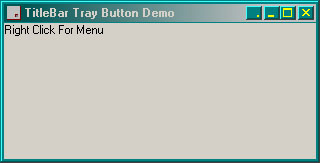

<div align="center">

## TrayButton in TitleBar


</div>

### Description

This has kept me occupied for a couple weeks.

Most of what is in here I learned to use while writing it.

I think I have thought of everything, but maybe not.

The button draws itself in the correct system colours, it sizes and positions itself according to system settings.

I have noticed that the TrayMenu does not react properly in the development environment, it does behave itself once compiled though. Also, when compiled, the Tooltip does not work until after you have restored the App from the system tray, but it works ok in the development environment. I don't know why this is, maybe someone could explain it for me.
 
### More Info
 
This project uses subclassing, so make sure you use the close button to stop the program in Development Environment.DO NOT PRESS STOP IN THE TOOLBAR! DO NOT TYPE END TO CLOSE THE PROGRAM.


<span>             |<span>
---                |---
**Submitted On**   |2001-07-16 12:37:48
**By**             |[Mick Doherty](https://github.com/Planet-Source-Code/PSCIndex/blob/master/ByAuthor/mick-doherty.md)
**Level**          |Intermediate
**User Rating**    |4.9 (64 globes from 13 users)
**Compatibility**  |VB 5\.0
**Category**       |[Windows API Call/ Explanation](https://github.com/Planet-Source-Code/PSCIndex/blob/master/ByCategory/windows-api-call-explanation__1-39.md)
**World**          |[Visual Basic](https://github.com/Planet-Source-Code/PSCIndex/blob/master/ByWorld/visual-basic.md)
**Archive File**   |[TrayButton228547162001\.zip](https://github.com/Planet-Source-Code/mick-doherty-traybutton-in-titlebar__1-23250/archive/master.zip)

### API Declarations

```
AppendMenu
CallWindowProc
CreatePopupMenu
CreateWindowEx
DestroyMenu
DestroyWindow
DrawFrameControl
FillRect
GetAsyncKeyState
GetCursorPos
GetSysColorBrush
GetSystemMetrics
GetTitleBarInfo
GetWindowDC
PtInRect
Shell_NotifyIcon
SendMessage
SetWindowLong
SetWindowPos
TrackPopupMenu
```


